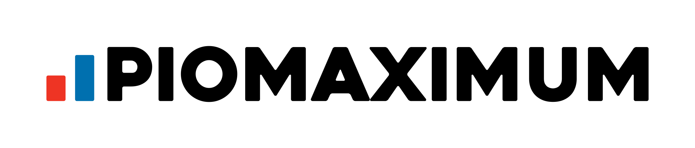

# Piomaximum
Právě si prohlížíte kódy k webovým stránkám Piomaxima – platformy určené pro vzdělávání nejen pionýrských vedoucích a instruktorů, která probíhá pod organizací Ledyho, Chemika a Sluníčka z oddílu 48. PTO Stezka. Web je přístupný na adrese [piomaximum.jmpionyr.cz](http://piomaximum.jmpionyr.cz/).

## Kód
Web je složen z jediné stránky `index.php`, do které je zahrnut obsah souborů ve složce `includes`. Design je vytvořen primárně pomocí volně použitelného CSS frameworku [w3.css](https://www.w3schools.com/w3css/default.asp) a menších stylových úprav v `main.css`. Veškeré obrázky jsou pak uložené ve složce `img`.

V repozitáři chybí soubory `db_connect.php` a `db_close.php`, které obsahují pouze pár řádků kódu k připojení k databázi, respektive k ukončení spojení.

